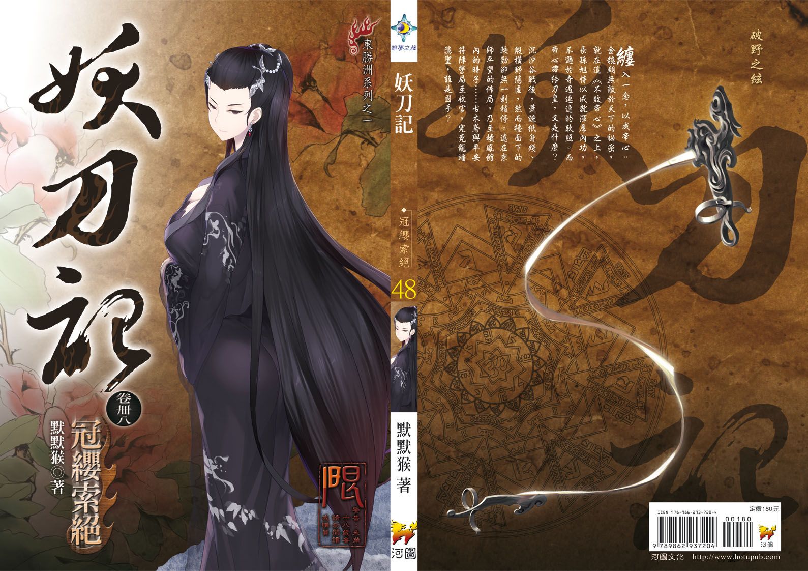

　　雖然這回挑戰月刊並未成功，但《妖刀記》卌八卷〈冠纓索絕〉，預定在７月
１３日出版，照慣例請各位舊雨新知多多支持，不吝指教。
　　
　　先聊聊這個很有拽文嫌疑的卷題。出自《史記‧滑稽列傳》，相當有名：
　　
　　戰國時代，楚發兵攻打齊國，齊威王嚇到吃手手，趕緊派幹話專家淳于髠向趙
國求援，心想嘴砲無敵惠而不費，規費神馬的就慶菜啦！只給了金百斤、車馬十駟
當禮物，用今天的話說，就是聘金六萬還所得稅內含、禮車就紙紮賓士拿去燒一燒
的意思，你娶根懶叫算了。
　　
　　淳于髠一聽就科科，笑到帽帶斷掉；齊威王就算是隻豬，也知道自己即將要被
幹到飛天，臭臉問你他媽笑三小。
　　
　　淳于髠直接噴了整組濃純香的幹話給他，說林北來的路上，看到農夫準備了蹄
膀跟酒，祈禱說踢公背啊，你要保佑我今年賺死，最好能直接把北農買下來，隨隨
便便買個七間就好……啊大王你有看過這種用塊蹄膀想賺七間北農的北七嗎？
　　
　　齊威王想說好啦好啦，就加錢嘛，靠北這麼多是怎樣，換成黃金兩萬兩、博物
館收藏級ＧＩＡ精品十組。趙王一看潮爽der~，發兵十萬馳援，楚國就直接下線登
出了，白癡才跟你打中路。
　　
　　【名詞解釋】冠，帽子。纓，繩子，這邊指帽帶。索，全部。絕，斷掉。
　　
　　冠纓索絕，字面上是指「帽帶斷掉」，因為淳于髠是笑到把帽帶弄斷，也引伸
有「大笑」的意思。但卌八卷取的不是引伸，而是字面上的意思。
　　
　　把帽帶一把扯斷，是什麼意思？代表斯文到此為止。接下來，就要打架了。
　　　　　　
　　　　　　
　　　　　　
────────────────────────────────────
　　　　　　
　　　　　　
　　　　　　
《妖刀記》卷四八　冠纓索絕　　
　　
◎書目
　　
　　第二七二折　帝里鳴珂，掌降如璽
　　
　　第二七三折　獄龍紫氣，不敗帝心
　　
　　第二七四折　苦海迷覺，能奪夜令
　　
　　第二七五折　雪鄉應在，寒苔千里
　　
　　第二七六折　誰與同命，靈鳥迦陵
　　
　　第二七七折　曦月無見，其風如霆
　　
　　第二七八折　氣運當換，孰論高低
　　
　　第二七九折　四時楚雨，銷魂清映
　　
　　
　　
◎簡介
　　
　　
　　纏入一念，以成帝心。金貔朝無敵於天下的秘密，就在這《不敗帝心》之上，
長孫旭恃以成就渾厚內功，不遜於奇遇連連的耿照。而帝心帶給刀皇，又是什麼？
　　
　　沉沙谷戰後，蕭諫紙身殘、殷橫野隱匿，檯面下的較勁卻無一刻稍停；親手砍
下七叔頭顱的阿傻，更將迎來上意的決裁……古木鳶與平安符陣營局至收官，究竟
龍蟠隱聖，誰是國手？
　　

